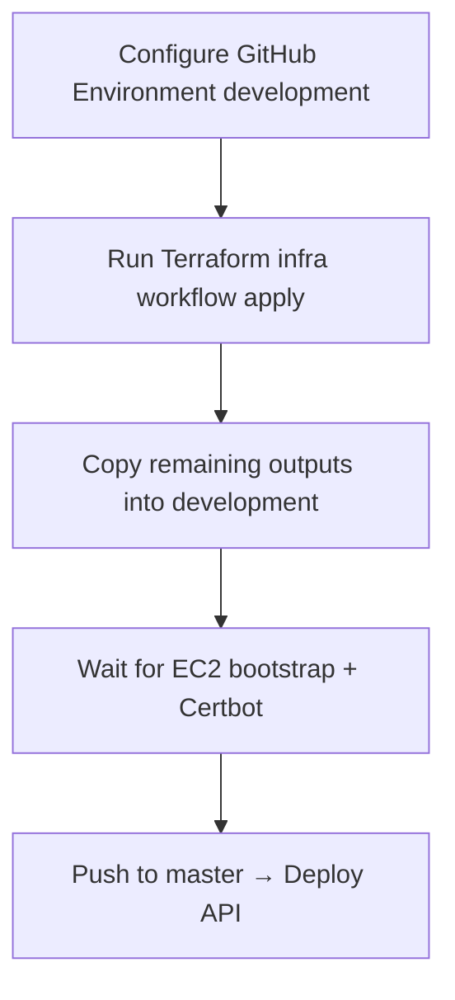

# Bells SIS — test AWS stack (cycbankease.com)

Terraform lives in **`infra/`** (this repo) or **`api/infra/`** (monorepo).

## Where to run Terraform (GitHub Actions)

| Repo layout | Workflow location | Actions tab |
|-------------|-------------------|-------------|
| **This repo** (api only) | `.github/workflows/terraform-infra.yml` | **Terraform infra (bells-sis)** |
| Monorepo (`office`) | `/.github/workflows/terraform-infra.yml` | Same workflow name at repo root |

If you only pushed the **api** repo, use **Actions → Terraform infra (bells-sis) → Run workflow → apply** in **this** repository — not the monorepo.

Terraform under this directory provisions:

| Resource | Detail |
|----------|--------|
| EC2 `t3.micro` + EIP | API at **`bells-api.cycbankease.com`** (nginx, PHP 8.4-FPM, Certbot, Supervisor) |
| Route 53 A | `bells-api` only — **does not touch `api.cycbankease.com`** |
| Existing RDS | Attaches to **`prod-bankease`**; creates schema **`bells_sis`** (not `bankease`) |
| S3 + CloudFront | Staff + student SPAs with `www` alternates |
| SSM | No SSH key on EC2 — deploy via Session Manager / SSM Run Command |

## Hostnames

| Host | Target |
|------|--------|
| `bells-api.cycbankease.com` | EC2 Elastic IP |
| `staff.cycbankease.com` | CloudFront → new staff S3 bucket |
| `www.staff.cycbankease.com` | Same staff CloudFront |
| `student.cycbankease.com` | CloudFront → new student S3 bucket |
| `www.student.cycbankease.com` | Same student CloudFront |

## GitHub Actions environments

| GitHub Environment | Deploy target | Use for |
|--------------------|---------------|---------|
| **`development`** | AWS (SSM / S3 / CloudFront) | cycbankease.com test stack |
| **`production`** | VPS (SSH) | Live Apache host |

Push to **`master`** deploys to **`development`** by default. Set repo var `DEPLOY_ENVIRONMENT=production` to change push behaviour.

## Bootstrap order (first time)

Infrastructure must exist **before** the API deploy workflow can succeed. Use this sequence:



### Step 1 — GitHub Environment `development`

Terraform and API deploy both use **`development`**. Credential flow:

**First Terraform apply** — use **admin** AWS credentials (broad permissions + S3 state):

| Secret / var | Purpose |
|--------------|---------|
| `AWS_ACCESS_KEY_ID` + `AWS_SECRET_ACCESS_KEY` | Recommended for first apply (leave `AWS_ROLE_ARN` unset) |
| — or — `AWS_ROLE_ARN` | Admin OIDC role for Terraform (not the deploy role yet) |
| `LETSENCRYPT_EMAIL` | Certbot on EC2 (`TF_VAR_letsencrypt_email`) |
| `GITHUB_REPOSITORY` (var, optional) | Defaults to **this repo** for OIDC deploy role |

**After first apply** — add deploy outputs (Step 3). Set `AWS_ROLE_ARN` to `github_deploy_role_arn` for **Deploy API**. Keep admin access keys if you need to re-run Terraform later (the deploy role cannot run Terraform).

The Terraform principal also needs **S3 access** to remote state bucket **`unibadanmfb-tf-state`** (object key `bells-sis/terraform.tfstate`): `s3:ListBucket` on the bucket, and `s3:GetObject` / `s3:PutObject` / `s3:DeleteObject` on `bells-sis/*`.

#### IAM permissions for Terraform (`unibadan` or admin role)

This stack uses many services. If apply fails with `AccessDeniedException`, attach missing actions to the user/role running Terraform. **CloudFront SPA certs use ACM in `us-east-1`** (separate from EC2 in the same region).

Minimum **ACM** (fix for `acm:RequestCertificate`):

```json
{
  "Version": "2012-10-17",
  "Statement": [{
    "Sid": "AcmForCloudFrontSpa",
    "Effect": "Allow",
    "Action": [
      "acm:RequestCertificate",
      "acm:DescribeCertificate",
      "acm:DeleteCertificate",
      "acm:AddTagsToCertificate",
      "acm:ListTagsForCertificate",
      "acm:GetCertificate"
    ],
    "Resource": "arn:aws:acm:us-east-1:299665806483:certificate/*"
  }]
}
```

You will also need (at minimum) **Route 53** (hosted zone + cert validation records), **CloudFront**, **EC2**, **EIP**, **S3**, **IAM**, **Secrets Manager**, **RDS security group rules** (modify existing SG), and **SSM**-related IAM. Easiest path: attach **`PowerUserAccess`** plus **`IAMFullAccess`** for bootstrap, or a dedicated `bells-sis-terraform` policy reviewed by your AWS admin.

**OIDC role trust** (if using `AWS_ROLE_ARN` for Terraform):

```json
"StringLike": {
  "token.actions.githubusercontent.com:sub": "repo:YOUR_ORG/YOUR_API_REPO:environment:development"
}
```

Account-wide GitHub OIDC provider `token.actions.githubusercontent.com` is **created by Terraform** on first apply (`create_github_oidc_provider = true`, default). If it already exists in the account, either set `create_github_oidc_provider = false` in `terraform.tfvars`, or import:

```bash
terraform import 'aws_iam_openid_connect_provider.github[0]' token.actions.githubusercontent.com
```

### Step 2 — Run Terraform

**Actions → Terraform infra (bells-sis) → Run workflow → `apply`**

Or locally:

```bash
cd infra
cp terraform.tfvars.example terraform.tfvars
# edit letsencrypt_email, github_repository (your GitHub org/repo name)
terraform init && terraform apply
```

PRs / pushes to `master` that touch `infra/**` run **plan only**. Apply is **manual** (`workflow_dispatch`).

### Step 3 — Copy outputs → same `development` environment

After apply, open the workflow **job summary** (or `terraform output`) and add:

| development secret | terraform output |
|--------------------|------------------|
| `AWS_ROLE_ARN` | `github_deploy_role_arn` |

| development variable or secret (same name) | terraform output / fixed |
|--------------------------------------------|--------------------------|
| `AWS_EC2_INSTANCE_ID` | `api_instance_id` |
| `AWS_DEPLOY_S3_BUCKET` | `deploy_s3_bucket` |
| `AWS_EC2_PATH` | `/var/www/api` |
| `VITE_API_URL` | `https://` + `api_fqdn` |
| `VITE_STUDENT_URL` | `student_url` |
| `AWS_S3_STAFF_BUCKET` | `staff_bucket` (optional; defaults to `bells-sis-staff-<account>`) |
| `AWS_S3_STUDENT_BUCKET` | `student_bucket` (optional; defaults to `bells-sis-student-<account>`) |
| `AWS_CLOUDFRONT_STAFF_ID` | `staff_cloudfront_id` |
| `AWS_CLOUDFRONT_STUDENT_ID` | `student_cloudfront_id` |

If a GitHub **variable** is empty, the workflow reads the **secret** with the same name.

### Step 4 — Wait, then deploy

EC2 user-data installs nginx, PHP, Supervisor, and retries Certbot (~5–10 minutes). Then push to **`master`** (or run **Deploy API** manually with environment `development`).

### Terraform stuck on `aws_instance.api: Still creating...`

Terraform marks EC2 **created** when AWS reports state **`running`** (usually **1–3 minutes**). It does **not** wait for user-data/bootstrap. If you see **15–20+ minutes** on this line:

1. **EC2 console** → find `test-bells-sis-api` → check **Instance state** and **Status checks**.
2. **Actions → Monitor and troubleshoot → Get system log** / **Instance reachability** for errors.
3. Common causes: **InsufficientInstanceCapacity** for the chosen instance type in that AZ, subnet out of IPs, or account/vCPU limits.
4. If state is already **running** but Terraform still waits, note the instance id and refresh/cancel the stuck apply (rare provider/API glitch).

Mitigations: try another subnet/AZ, or change **`instance_type`** in tfvars, or retry apply later. Bootstrap logs (`/var/log/bells-sis-user-data.log`) only matter **after** Terraform finishes EC2 create.

**`cloud-init status: error` / launcher fails on `awscli`:** Ubuntu 24.04 Noble has no `apt install awscli`. Bootstrap templates install **AWS CLI v2** from AWS. Re-run **`terraform apply`** (updates the S3 bootstrap script; replace the instance or run bootstrap manually on the box).

Configure **`production`** separately for VPS when ready — it does not depend on Terraform.

### `development` (AWS) — secrets

| Secret | Value |
|--------|--------|
| **`AWS_ROLE_ARN`** | `terraform output -raw github_deploy_role_arn` |

### `development` (AWS) — variables

| Variable | Example |
|----------|---------|
| `AWS_REGION` | `us-east-1` |
| `AWS_EC2_INSTANCE_ID` | `terraform output -raw api_instance_id` |
| `AWS_EC2_PATH` | `/var/www/api` |
| `AWS_DEPLOY_S3_BUCKET` | `terraform output -raw deploy_s3_bucket` |
| `VITE_API_URL` | `https://bells-api.cycbankease.com` |
| `VITE_STUDENT_URL` | `https://student.cycbankease.com` |
| `AWS_S3_STAFF_BUCKET` | `bells-sis-staff-299665806483` (or leave unset to auto-detect) |
| `AWS_S3_STUDENT_BUCKET` | `bells-sis-student-<account>` |
| `AWS_CLOUDFRONT_STAFF_ID` | `staff_cloudfront_id` |
| `AWS_CLOUDFRONT_STUDENT_ID` | `student_cloudfront_id` |

Staff and student share `development`. Use `AWS_S3_STAFF_BUCKET` / `AWS_S3_STUDENT_BUCKET` (and matching CloudFront ids). If those vars are empty, deploy uses `bells-sis-staff-<account-id>` / `bells-sis-student-<account-id>`.

### `production` (VPS) — secrets

| Secret | Value |
|--------|--------|
| **`DEPLOY_SSH_KEY`** or **`VPS_SSH_KEY`** | Private key for production VPS |

### `production` (VPS) — variables

| Variable | Example |
|----------|---------|
| `VITE_API_URL` | `https://api.your-vps-domain` |
| `VITE_STUDENT_URL` | `/student` or full student URL |
| `VPS_HOST` | production server IP/hostname |
| `VPS_USER` | `deploy` |
| `VPS_API_PATH` | `/var/www/api/public_html` |
| `VPS_FRONTEND_PATH` | staff dist path |
| `VPS_STUDENT_PATH` | student dist path |

Optional override on any environment: `DEPLOY_TARGET` = `aws` or `vps` (normally derived from environment name).

In `terraform.tfvars`, set **`github_repository = "your-org/office"`** so Terraform creates the OIDC deploy role.

## Remote state

State is stored in S3 (not in git):

| Setting | Value |
|---------|--------|
| Bucket | `unibadanmfb-tf-state` |
| Key | `bells-sis/terraform.tfstate` |
| Region | `us-east-1` |

Configured in `versions.tf`. After pulling this change, run `terraform init` (or re-run the infra workflow) so Terraform migrates any local state into S3.

## Apply

```bash
cd api/infra
cp terraform.tfvars.example terraform.tfvars
# edit letsencrypt_email, github_repository

terraform init
terraform plan
terraform apply
```

Outputs to copy into GitHub: `github_deploy_role_arn`, `api_instance_id`, `deploy_s3_bucket`, `staff_bucket`, `student_bucket`, CloudFront ids.

## Manual access (SSM)

```bash
aws ssm start-session --target "$(terraform output -raw api_instance_id)" --region us-east-1
```

No key pair is created on the EC2 instance.

## Deploy Laravel API (manual)

GitHub Actions runs SSM deploy automatically on push to `api/**` when vars above are set.

Manual release on the instance after syncing code:

```bash
cd /var/www/api
sudo -u www-data composer install --no-dev --optimize-autoloader
sudo -u www-data php artisan migrate --force
sudo -u www-data php artisan storage:link
sudo -u www-data php artisan optimize
sudo supervisorctl restart bells-sis-queue bells-sis-scheduler
```

Health check: `https://bells-api.cycbankease.com/up`

Supervisor logs: `/var/log/bells-sis/queue.log`, `/var/log/bells-sis/scheduler.log`

### `SQLSTATE[HY000] [1045] Access denied for user 'bells_sis_app'@'172.x.x.x'`

That is MySQL auth, not a security-group timeout (you already reached RDS). Usual cause: bootstrap wrote `DB_PASSWORD` unquoted, so `#` or `$` in the Secrets Manager password was truncated by dotenv.

Re-run **Deploy API**. Release now pulls `test/bells-sis/rds/app`, quotes `DB_PASSWORD`, and `GRANT`s `bells_sis_app`@`%` using `prod/bankease/rds/master`. You do not need a Terraform apply for the existing instance.

To confirm after deploy (does not print the password):

```bash
sudo grep -E '^DB_(USERNAME|PASSWORD)=' /var/www/api/.env
# DB_PASSWORD must be wrapped in double quotes
```

### `SQLSTATE[HY000]: General error: 1419` (audit_logs trigger / SUPER)

Shared RDS (`prod-bankease`) has binary logging on. The app user cannot have SUPER, so `CREATE TRIGGER` fails unless the instance parameter `log_bin_trust_function_creators=1`.

Migrate now skips that trigger on 1419. Audit rows stay immutable in `App\Models\AuditLog`. Optional: ask whoever owns BankEase RDS to set `log_bin_trust_function_creators=1` if you want the database trigger as well.

### HTTPS

The API is `https://bells-api.cycbankease.com` (nginx + Let's Encrypt). HTTP on port 80 redirects to HTTPS. Use the hostname, not the Elastic IP — the certificate will not match `https://<eip>/`.

Each API deploy re-runs `scripts/ensure-https.sh` (skipped on VPS). If the browser still shows a certificate warning, Certbot never issued a trusted cert (empty `LETSENCRYPT_EMAIL` at first Terraform apply, or DNS was not pointing at the EIP yet). Re-run **Deploy API**; check `/var/log/bells-sis-user-data.log` for `certbot`.

`https://staff.cycbankease.com` and `https://student.cycbankease.com` are CloudFront. TLS is on; an empty S3 bucket looks like HTTP 403 `AccessDenied`. Deploy the staff and student workflows (`DEPLOY_TARGET=aws`) so `index.html` is uploaded.

## Deploy staff / student SPAs

See build commands below, or use the staff workflow in `frontend/.github/workflows/deploy.yml` and `deploy-student.yml` with environment `development` for AWS.

```bash
cd frontend
echo 'VITE_API_URL=https://bells-api.cycbankease.com' > .env.production
echo 'VITE_STUDENT_URL=https://student.cycbankease.com' >> .env.production
npm ci && npm run build
aws s3 sync dist/ "s3://$(cd ../api/infra && terraform output -raw staff_bucket)/" --delete
aws cloudfront create-invalidation \
  --distribution-id "$(cd ../api/infra && terraform output -raw staff_cloudfront_id)" --paths "/*"
```

Student (CloudFront subdomain — use `VITE_BASE=/`):

```bash
cd student
echo 'VITE_API_URL=https://bells-api.cycbankease.com' > .env.production
echo 'VITE_BASE=/' >> .env.production
npm ci && VITE_BASE=/ npm run build
aws s3 sync dist/ "s3://$(cd ../api/infra && terraform output -raw student_bucket)/" --delete
aws cloudfront create-invalidation \
  --distribution-id "$(cd ../api/infra && terraform output -raw student_cloudfront_id)" --paths "/*"
```

## Destroy

```bash
terraform destroy
```

This removes the EC2, EIP, SIS Route 53 records, SPA buckets/distributions, and the SG rule added to RDS. It does **not** delete RDS or `api.cycbankease.com`.
