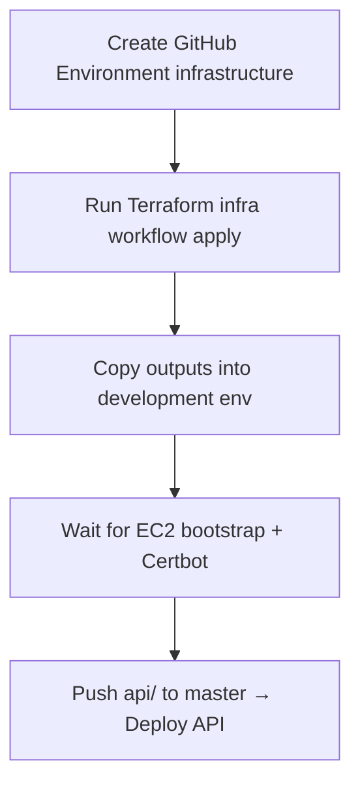

# Bells SIS — test AWS stack (cycbankease.com)

Terraform under this directory provisions:

| Resource | Detail |
|----------|--------|
| EC2 `t2.micro` + EIP | API at **`bells-api.cycbankease.com`** (nginx, PHP 8.3-FPM, Certbot, Supervisor) |
| Route 53 A | `bells-api` only — **does not touch `api.cycbankease.com`** |
| Existing RDS | Attaches to **`prod-bankease`**; creates schema **`bells_sis`** (not `bankease`) |
| S3 + CloudFront | Staff + student SPAs with `www` alternates |
| SSM | No SSH key on EC2 — deploy via Session Manager / SSM Run Command |

## Hostnames

| Host | Target |
|------|--------|
| `bells-api.cycbankease.com` | EC2 Elastic IP |
| `staff.cycbankease.com` | CloudFront → new staff S3 bucket |
| `www.staff.cycbankease.com` | Same staff CloudFront |
| `student.cycbankease.com` | CloudFront → new student S3 bucket |
| `www.student.cycbankease.com` | Same student CloudFront |

## GitHub Actions environments

| GitHub Environment | Deploy target | Use for |
|--------------------|---------------|---------|
| **`development`** | AWS (SSM / S3 / CloudFront) | cycbankease.com test stack |
| **`production`** | VPS (SSH) | Live Apache host |

Push to **`master`** deploys to **`development`** by default. Set repo var `DEPLOY_ENVIRONMENT=production` to change push behaviour.

## Bootstrap order (first time)

Infrastructure must exist **before** the API deploy workflow can succeed. Use this sequence:



### Step 1 — GitHub Environment `infrastructure`

For Terraform only (needs broad AWS permissions — **not** the same role as deploy):

| Secret / var | Purpose |
|--------------|---------|
| `AWS_ROLE_ARN` or `AWS_ACCESS_KEY_ID` + `AWS_SECRET_ACCESS_KEY` | Run Terraform |
| `LETSENCRYPT_EMAIL` | Certbot on EC2 (`TF_VAR_letsencrypt_email`) |
| `GITHUB_REPOSITORY` (var, optional) | Defaults to this repo (`org/office`) for OIDC deploy role |

The Terraform role also needs **S3 access** to remote state bucket **`unibadanmfb-tf-state`** (object key `bells-sis/terraform.tfstate`): `s3:ListBucket` on the bucket, and `s3:GetObject` / `s3:PutObject` / `s3:DeleteObject` on `bells-sis/*`.

### Step 2 — Run Terraform

**Actions → Terraform infra (bells-sis) → Run workflow → `apply`**

Or locally:

```bash
cd api/infra
cp terraform.tfvars.example terraform.tfvars
# edit letsencrypt_email, github_repository
terraform init && terraform apply
```

PRs / pushes to `master` that touch `api/infra/**` run **plan only**. Apply is **manual** (`workflow_dispatch`).

### Step 3 — Copy outputs → Environment `development`

After apply, open the workflow **job summary** (or `terraform output`) and set:

| development secret | terraform output |
|--------------------|------------------|
| `AWS_ROLE_ARN` | `github_deploy_role_arn` |

| development variable | terraform output / fixed |
|----------------------|--------------------------|
| `AWS_EC2_INSTANCE_ID` | `api_instance_id` |
| `AWS_DEPLOY_S3_BUCKET` | `deploy_s3_bucket` |
| `AWS_EC2_PATH` | `/var/www/api` |
| `VITE_API_URL` | `https://` + `api_fqdn` |
| `VITE_STUDENT_URL` | `student_url` |
| `AWS_S3_BUCKET` | `staff_bucket` (staff workflow) |
| `AWS_CLOUDFRONT_DISTRIBUTION_ID` | `staff_cloudfront_id` |

For student deploys, point `AWS_S3_BUCKET` / CloudFront id at `student_bucket` / `student_cloudfront_id` (same env or a second env).

### Step 4 — Wait, then deploy

EC2 user-data installs nginx, PHP, Supervisor, and retries Certbot (~5–10 minutes). Then push to **`master`** (or run **Deploy API** manually with environment `development`).

Configure **`production`** separately for VPS when ready — it does not depend on Terraform.

### `development` (AWS) — secrets

| Secret | Value |
|--------|--------|
| **`AWS_ROLE_ARN`** | `terraform output -raw github_deploy_role_arn` |

### `development` (AWS) — variables

| Variable | Example |
|----------|---------|
| `AWS_REGION` | `us-east-1` |
| `AWS_EC2_INSTANCE_ID` | `terraform output -raw api_instance_id` |
| `AWS_EC2_PATH` | `/var/www/api` |
| `AWS_DEPLOY_S3_BUCKET` | `terraform output -raw deploy_s3_bucket` |
| `VITE_API_URL` | `https://bells-api.cycbankease.com` |
| `VITE_STUDENT_URL` | `https://student.cycbankease.com` |
| `AWS_S3_BUCKET` | staff or student bucket (set per workflow env if needed) |
| `AWS_CLOUDFRONT_DISTRIBUTION_ID` | matching CloudFront id |

Staff and student share one `development` environment but need **different** `AWS_S3_BUCKET` / CloudFront ids — use separate GitHub environments (`development-staff`, `development-student`) or override via workflow env.

### `production` (VPS) — secrets

| Secret | Value |
|--------|--------|
| **`DEPLOY_SSH_KEY`** or **`VPS_SSH_KEY`** | Private key for production VPS |

### `production` (VPS) — variables

| Variable | Example |
|----------|---------|
| `VITE_API_URL` | `https://api.your-vps-domain` |
| `VITE_STUDENT_URL` | `/student` or full student URL |
| `VPS_HOST` | production server IP/hostname |
| `VPS_USER` | `deploy` |
| `VPS_API_PATH` | `/var/www/api/public_html` |
| `VPS_FRONTEND_PATH` | staff dist path |
| `VPS_STUDENT_PATH` | student dist path |

Optional override on any environment: `DEPLOY_TARGET` = `aws` or `vps` (normally derived from environment name).

In `terraform.tfvars`, set **`github_repository = "your-org/office"`** so Terraform creates the OIDC deploy role.

## Remote state

State is stored in S3 (not in git):

| Setting | Value |
|---------|--------|
| Bucket | `unibadanmfb-tf-state` |
| Key | `bells-sis/terraform.tfstate` |
| Region | `us-east-1` |

Configured in `versions.tf`. After pulling this change, run `terraform init` (or re-run the infra workflow) so Terraform migrates any local state into S3.

## Apply

```bash
cd api/infra
cp terraform.tfvars.example terraform.tfvars
# edit letsencrypt_email, github_repository

terraform init
terraform plan
terraform apply
```

Outputs to copy into GitHub: `github_deploy_role_arn`, `api_instance_id`, `deploy_s3_bucket`, `staff_bucket`, `student_bucket`, CloudFront ids.

## Manual access (SSM)

```bash
aws ssm start-session --target "$(terraform output -raw api_instance_id)" --region us-east-1
```

No key pair is created on the EC2 instance.

## Deploy Laravel API (manual)

GitHub Actions runs SSM deploy automatically on push to `api/**` when vars above are set.

Manual release on the instance after syncing code:

```bash
cd /var/www/api
sudo -u www-data composer install --no-dev --optimize-autoloader
sudo -u www-data php artisan migrate --force
sudo -u www-data php artisan storage:link
sudo -u www-data php artisan optimize
sudo supervisorctl restart bells-sis-queue bells-sis-scheduler
```

Health check: `https://bells-api.cycbankease.com/up`

Supervisor logs: `/var/log/bells-sis/queue.log`, `/var/log/bells-sis/scheduler.log`

## Deploy staff / student SPAs

See build commands below, or use `deploy-frontend.yml` / `deploy-student.yml` with `DEPLOY_TARGET=aws`.

```bash
cd frontend
echo 'VITE_API_URL=https://bells-api.cycbankease.com' > .env.production
echo 'VITE_STUDENT_URL=https://student.cycbankease.com' >> .env.production
npm ci && npm run build
aws s3 sync dist/ "s3://$(cd ../api/infra && terraform output -raw staff_bucket)/" --delete
aws cloudfront create-invalidation \
  --distribution-id "$(cd ../api/infra && terraform output -raw staff_cloudfront_id)" --paths "/*"
```

Student (CloudFront subdomain — use `VITE_BASE=/`):

```bash
cd student
echo 'VITE_API_URL=https://bells-api.cycbankease.com' > .env.production
echo 'VITE_BASE=/' >> .env.production
npm ci && VITE_BASE=/ npm run build
aws s3 sync dist/ "s3://$(cd ../api/infra && terraform output -raw student_bucket)/" --delete
aws cloudfront create-invalidation \
  --distribution-id "$(cd ../api/infra && terraform output -raw student_cloudfront_id)" --paths "/*"
```

## Destroy

```bash
terraform destroy
```

This removes the EC2, EIP, SIS Route 53 records, SPA buckets/distributions, and the SG rule added to RDS. It does **not** delete RDS or `api.cycbankease.com`.
